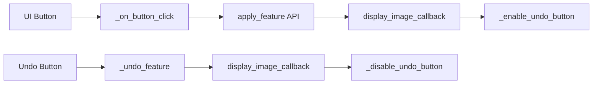
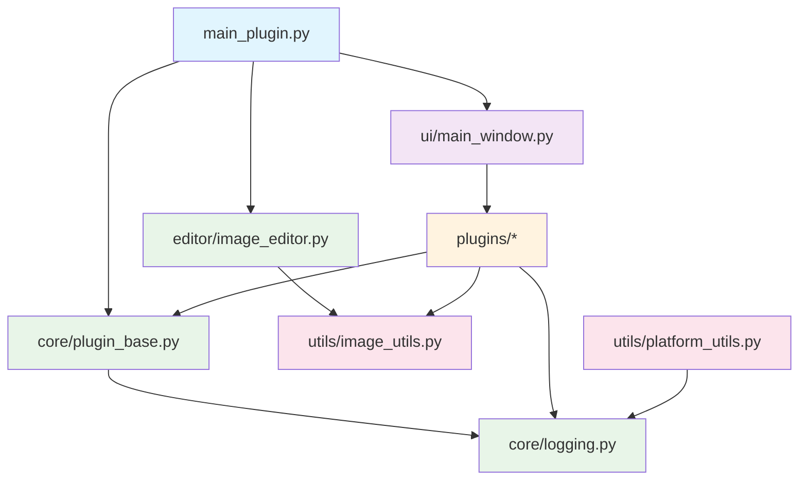
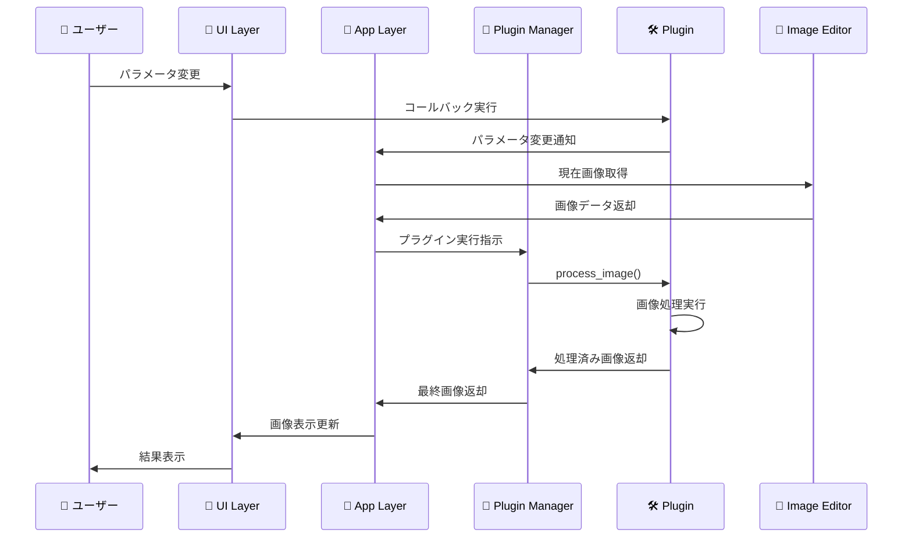
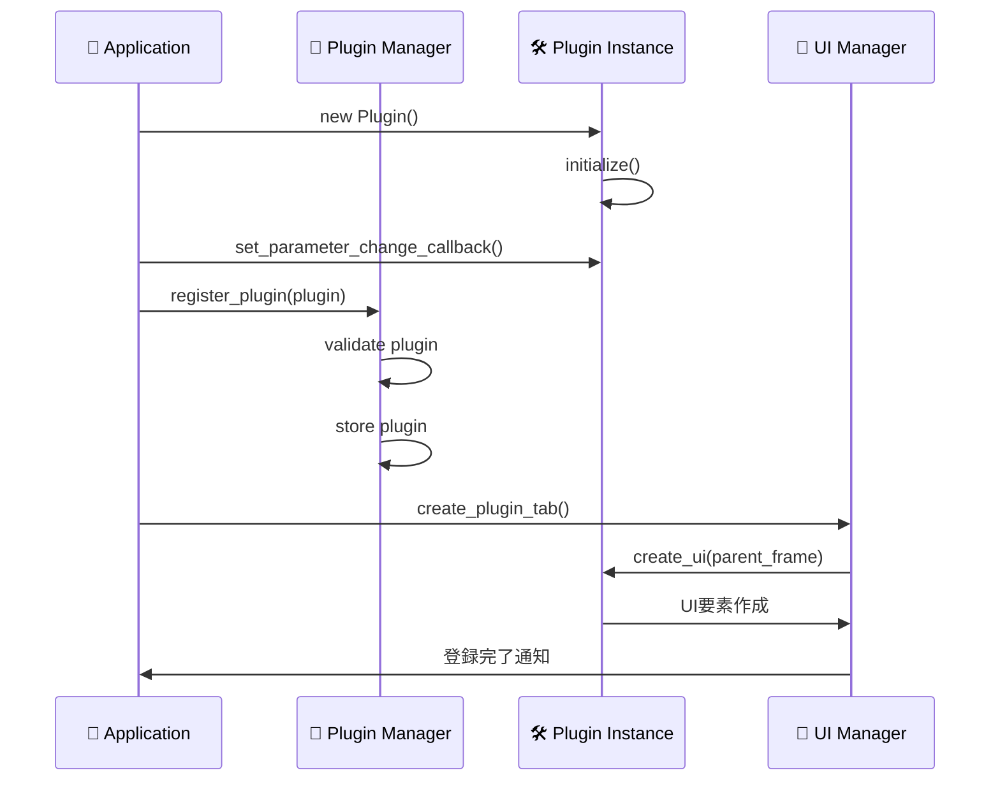

# アーキテクチャ設計 - Advanced Image Editor

> 🏠 **メインハブ**: [README](../README.md) へ戻る | **関連ドキュメント**: [ユーザーガイド](USER_GUIDE.md) | [開発者ガイド](DEVELOPER_GUIDE.md) | [技術ノート](TECHNICAL_NOTES.md)

## 目次
- [システム概要](#システム概要)
- [アーキテクチャパターン](#アーキテクチャパターン)
- [プラグインシステム](#プラグインシステム)
- [モジュール設計](#モジュール設計)
- [データフロー](#データフロー)
- [拡張性設計](#拡張性設計)

## システム概要

Advanced Image Editorは、**プラグインアーキテクチャ**を採用したモジュラー画像編集アプリケーションです。各機能を独立したプラグインとして実装することで、高い保守性・拡張性・テスタビリティを実現しています。

### 設計原則

#### 🎯 SOLID原則準拠
- **S**ingle Responsibility: 各クラスは単一の責任を持つ
- **O**pen/Closed: 拡張に開放、修正に閉鎖
- **L**iskov Substitution: 派生クラスは基底クラスと置換可能
- **I**nterface Segregation: インターフェースは最小限に分離
- **D**ependency Inversion: 抽象に依存、具象に依存しない

#### 🏗️ 設計パターン
- **Plugin Pattern**: 機能の動的拡張
- **Strategy Pattern**: アルゴリズムの切り替え
- **Observer Pattern**: イベント通知
- **Template Method**: 共通処理の抽象化
- **Dependency Injection**: 依存関係の注入

## アーキテクチャパターン

### レイヤードアーキテクチャ

```
┌─────────────────────────────────────────┐
│              Presentation Layer          │  ← UI/UX
├─────────────────────────────────────────┤
│              Application Layer           │  ← プラグイン管理
├─────────────────────────────────────────┤
│               Domain Layer               │  ← 画像処理ロジック
├─────────────────────────────────────────┤
│            Infrastructure Layer          │  ← ファイルI/O, ログ
└─────────────────────────────────────────┘
```

#### Presentation Layer（プレゼンテーション層）
- **担当**: ユーザーインターフェース、イベント処理
- **構成要素**: 
  - `ui/main_window.py`: メインウィンドウ
  - `ui/curve_editor.py`: カーブエディター
  - CustomTkinter UI コンポーネント

#### Application Layer（アプリケーション層）
- **担当**: プラグイン管理、ワークフロー制御
- **構成要素**:
  - `main_plugin.py`: アプリケーション制御
  - `core/plugin_base.py`: プラグイン基盤
  - プラグイン管理システム

#### Domain Layer（ドメイン層）
- **担当**: 画像処理ロジック、ビジネスルール
- **構成要素**:
  - `editor/image_editor.py`: 画像編集ドメイン
  - `utils/image_utils.py`: 画像処理アルゴリズム
  - 各プラグインの処理ロジック

#### Infrastructure Layer（インフラストラクチャ層）
- **担当**: 外部依存関係、永続化、ログ
- **構成要素**:
  - `core/logging.py`: ログ管理
  - `utils/platform_utils.py`: プラットフォーム依存処理
  - ファイルI/O処理

### プラグインアーキテクチャ

```
┌──────────────────────────────────────────────────────────┐
│                    Plugin Host                           │
│  ┌─────────────────┐    ┌─────────────────────────────┐  │
│  │ Plugin Manager  │    │     Plugin Registry         │  │
│  │                 │    │                             │  │
│  │ - 登録          │◄──►│ - プラグイン一覧            │  │
│  │ - 実行制御      │    │ - メタデータ管理            │  │
│  │ - ライフサイクル│    │ - バージョン管理            │  │
│  └─────────────────┘    └─────────────────────────────┘  │
└──────────────────────────────────────────────────────────┘
                               │
                               ▼
┌──────────────────────────────────────────────────────────┐
│                 Plugin Interface                         │
│                                                          │
│  ┌─────────────────────────────────────────────────────┐ │
│  │              ImageProcessorPlugin                   │ │
│  │                                                     │ │
│  │ + get_display_name() → str                         │ │
│  │ + get_description() → str                          │ │
│  │ + create_ui(parent: CTkFrame) → None               │ │
│  │ + process_image(image: Image) → Image              │ │
│  │ + reset_parameters() → None                        │ │
│  │ + get_parameters() → dict                          │ │
│  └─────────────────────────────────────────────────────┘ │
└──────────────────────────────────────────────────────────┘
                               │
                               ▼
┌──────────────────────────────────────────────────────────┐
│                Concrete Plugins                          │
│                                                          │
│  ┌─────────────┐ ┌─────────────┐ ┌─────────────┐        │
│  │ Basic       │ │ Density     │ │ Filter      │  ...   │
│  │ Plugin      │ │ Plugin      │ │ Plugin      │        │
│  └─────────────┘ └─────────────┘ └─────────────┘        │
└──────────────────────────────────────────────────────────┘
```

## プラグインシステム

### プラグイン内部設計パターン（analysis_plugin.pyベース）

#### メソッド分類・命名規則

```python
# === 1. 基本情報・初期化セクション ===
def __init__(self, name="plugin_name"):          # プラグイン初期化
def get_display_name(self) -> str:               # UI表示名
def get_description(self) -> str:                # 機能説明  
def get_parameters(self) -> Dict[str, Any]:      # パラメータ取得
def set_image(self, image: Image.Image):         # 画像設定

# === 2. 外部コールバック設定API（パブリック） ===
def set_display_image_callback(self, callback):  # 画像表示用
def set_[feature]_callback(self, callback):      # 機能別コールバック
def set_undo_[feature]_callback(self, callback): # Undo機能用

# === 3. UI生成・管理API（パブリック） ===  
def setup_ui(self, parent):                      # UI初期化
def create_ui(self, parent):                     # UI要素作成

# === 4. 画像処理API（パブリック） ===
def apply_[feature](self, image, params):        # 機能別処理
def process_image(self, image, **params):        # 統合処理

# === 5. 内部イベントハンドラ（プライベート） ===
def _on_[action]_button(self):                   # ボタンイベント
def _apply_[feature](self, params):              # 内部処理実行
def _undo_[feature](self):                       # 取消処理
def _enable_undo_button(self, key):              # UI状態制御
def _disable_undo_button(self, key):             # UI状態制御
```

#### イベント処理フローパターン



### プラグイン基底クラス設計

```python
from abc import ABC, abstractmethod
from typing import Optional, Dict, Any, Callable
from PIL import Image
import customtkinter as ctk

class ImageProcessorPlugin(ABC):
    """
    画像処理プラグインの基底クラス
    
    全てのプラグインはこのクラスを継承し、
    必須メソッドを実装する必要があります。
    """
    
    def __init__(self, plugin_id: str, version: str):
        """
        プラグインの初期化
        
        Args:
            plugin_id: プラグインの一意識別子
            version: プラグインのバージョン
        """
        self.plugin_id = plugin_id
        self.version = version
        self._parameter_change_callback: Optional[Callable] = None
    
    # === 必須実装メソッド ===
    
    @abstractmethod
    def get_display_name(self) -> str:
        """UI表示用のプラグイン名を返す"""
        pass
    
    @abstractmethod
    def get_description(self) -> str:
        """プラグインの機能説明を返す"""
        pass
    
    @abstractmethod
    def create_ui(self, parent: ctk.CTkFrame) -> None:
        """プラグインのUI要素を作成"""
        pass
    
    @abstractmethod
    def process_image(self, image: Image.Image, **params) -> Image.Image:
        """画像処理を実行"""
        pass
    
    # === オプション実装メソッド ===
    
    def get_parameters(self) -> Dict[str, Any]:
        """現在のパラメータを辞書形式で返す"""
        return {}
    
    def reset_parameters(self) -> None:
        """パラメータをリセット"""
        pass
    
    def set_parameter_change_callback(self, callback: Callable) -> None:
        """パラメータ変更時のコールバックを設定"""
        self._parameter_change_callback = callback
    
    def _on_parameter_change(self) -> None:
        """パラメータ変更時の内部処理"""
        if self._parameter_change_callback:
            self._parameter_change_callback()
```

### プラグインマネージャー設計

```python
from typing import Dict, List, Optional
from core.logging import logger

class PluginManager:
    """
    プラグインのライフサイクル管理
    
    プラグインの登録・管理・実行制御を行います。
    """
    
    def __init__(self):
        self._plugins: Dict[str, ImageProcessorPlugin] = {}
        self._execution_order: List[str] = []
    
    def register_plugin(self, plugin: ImageProcessorPlugin) -> None:
        """
        プラグインを登録
        
        Args:
            plugin: 登録するプラグインインスタンス
        
        Raises:
            ValueError: 同じIDのプラグインが既に登録されている場合
        """
        if plugin.plugin_id in self._plugins:
            raise ValueError(f"プラグイン '{plugin.plugin_id}' は既に登録されています")
        
        self._plugins[plugin.plugin_id] = plugin
        self._execution_order.append(plugin.plugin_id)
        
        logger.info(f"プラグイン登録: {plugin.get_display_name()} (ID: {plugin.plugin_id})")
    
    def get_plugin(self, plugin_id: str) -> Optional[ImageProcessorPlugin]:
        """指定IDのプラグインを取得"""
        return self._plugins.get(plugin_id)
    
    def get_all_plugins(self) -> Dict[str, ImageProcessorPlugin]:
        """全プラグインを取得"""
        return self._plugins.copy()
    
    def unregister_plugin(self, plugin_id: str) -> bool:
        """
        プラグインの登録を解除
        
        Args:
            plugin_id: 解除するプラグインのID
            
        Returns:
            解除成功時True、プラグインが存在しない場合False
        """
        if plugin_id in self._plugins:
            del self._plugins[plugin_id]
            self._execution_order.remove(plugin_id)
            logger.info(f"プラグイン登録解除: {plugin_id}")
            return True
        return False
    
    def execute_plugin_chain(self, image: Image.Image, 
                           plugin_ids: Optional[List[str]] = None) -> Image.Image:
        """
        複数プラグインの順次実行
        
        Args:
            image: 処理対象画像
            plugin_ids: 実行するプラグインIDのリスト（Noneの場合は全プラグイン）
            
        Returns:
            処理済み画像
        """
        if plugin_ids is None:
            plugin_ids = self._execution_order
        
        result_image = image
        for plugin_id in plugin_ids:
            if plugin_id in self._plugins:
                try:
                    result_image = self._plugins[plugin_id].process_image(result_image)
                    logger.debug(f"プラグイン実行完了: {plugin_id}")
                except Exception as e:
                    logger.error(f"プラグイン実行エラー {plugin_id}: {e}")
                    # エラー時は処理を継続（前の状態を保持）
        
        return result_image
```

### コールバック設計パターン

#### 機能別コールバック分離
- **画像表示**: `set_display_image_callback` - 結果画像の即座表示
- **機能実行**: `set_[feature]_callback` - 特定機能の外部委譲  
- **Undo処理**: `set_undo_[feature]_callback` - 取消操作の外部制御

#### コールバック優先度制御
```python
def _apply_feature_detection(self, feature_type):
    # 1. 外部コールバック優先実行
    if hasattr(self, "feature_callback") and callable(self.feature_callback):
        self.feature_callback(feature_type)
    else:
        # 2. デフォルト内部処理
        if self.image is not None:
            result_img = self.apply_feature_detection(self.image, feature_type)
            if hasattr(self, 'display_image_callback'):
                self.display_image_callback(result_img)
```

### UI状態管理パターン（Undoボタン制御）

#### 状態制御メソッド
```python
def _enable_undo_button(self, key):
    """指定したUndoボタンを有効化する"""
    if hasattr(self, '_buttons') and key in self._buttons:
        self._buttons[key].configure(state="normal")

def _disable_undo_button(self, key):
    """指定したUndoボタンを無効化する"""
    if hasattr(self, '_buttons') and key in self._buttons:
        self._buttons[key].configure(state="disabled")
```

#### UI一貫性ルール
- 処理実行時: 対応するUndoボタンを有効化
- Undo実行時: Undoボタンを無効化
- エラー時: 状態をリセット

### エラーハンドリング設計

#### 段階的フォールバック
```python
def apply_feature_detection(self, image: Image.Image, feature_type: str) -> Image.Image:
    try:
        # メイン処理
        if feature_type == "sift":
            if hasattr(cv2, "SIFT_create"):
                sift = cv2.SIFT_create()
            elif hasattr(cv2, "xfeatures2d"):
                sift = cv2.xfeatures2d.SIFT_create()
            else:
                print("SIFTが利用できません")
                return image  # フォールバック: 元画像返却
    except Exception as e:
        print(f"処理エラー: {e}")
        return image  # 安全な復帰
```

#### ログ出力レベル
- `print("✅ 成功")`: 正常完了
- `print("⚠️ 警告")`: 警告・代替処理
- `print("❌ エラー")`: エラー・失敗

### プラグインマネージャー設計
```

## モジュール設計

### ディレクトリ構造と責任分担

```
src/
├── core/                    # 🏗️ システム中核
│   ├── plugin_base.py      # プラグイン基盤クラス
│   ├── logging.py          # 統一ログシステム  
│   └── __init__.py
├── plugins/                 # 🔌 プラグイン群
│   ├── basic/              # 基本調整機能
│   ├── density/            # 濃度・ガンマ調整
│   ├── filters/            # フィルター処理
│   ├── analysis/           # 画像解析
│   └── [future_plugins]/   # 将来の拡張
├── editor/                  # 📸 画像編集ドメイン
│   ├── image_editor.py     # 画像管理・操作
│   └── __init__.py
├── ui/                      # 🎨 ユーザーインターフェース
│   ├── main_window.py      # メインウィンドウ
│   ├── curve_editor.py     # カーブエディター
│   └── __init__.py
├── utils/                   # 🛠️ ユーティリティ
│   ├── image_utils.py      # 画像処理ヘルパー
│   ├── platform_utils.py   # プラットフォーム依存処理
│   └── __init__.py
└── main_plugin.py          # 🚀 アプリケーション起点
```

### モジュール間依存関係



### 依存関係の原則

#### 🎯 依存性注入パターン

```python
class AdvancedImageEditor:
    """
    メインアプリケーションクラス
    
    依存関係を外部から注入することで、
    テスタビリティと拡張性を確保
    """
    
    def __init__(self, 
                 plugin_manager: Optional[PluginManager] = None,
                 image_editor: Optional[ImageEditor] = None,
                 logger_config: Optional[Dict] = None):
        """
        依存関係の注入によるコンストラクタ
        """
        # 依存関係の初期化（デフォルト実装 or 注入されたもの）
        self.plugin_manager = plugin_manager or PluginManager()
        self.image_editor = image_editor or ImageEditor()
        
        # ログ設定
        if logger_config:
            self._configure_logging(logger_config)
    
    def _configure_logging(self, config: Dict) -> None:
        """ログ設定の適用"""
        # ログ設定ロジック
        pass
```

#### 🔌 インターフェース分離

```python
# 責任を細分化したインターフェース

class ImageProcessor(ABC):
    """画像処理専用インターフェース"""
    @abstractmethod
    def process_image(self, image: Image.Image) -> Image.Image:
        pass

class UICreator(ABC):
    """UI作成専用インターフェース"""
    @abstractmethod
    def create_ui(self, parent: ctk.CTkFrame) -> None:
        pass

class ParameterManager(ABC):
    """パラメータ管理専用インターフェース"""
    @abstractmethod
    def get_parameters(self) -> Dict[str, Any]:
        pass
    
    @abstractmethod
    def reset_parameters(self) -> None:
        pass

# プラグインは必要なインターフェースのみ実装
class BasicAdjustmentPlugin(ImageProcessor, UICreator, ParameterManager):
    """基本調整プラグイン"""
    # 必要なメソッドのみ実装
    pass
```

## データフロー

### 画像処理データフロー



### プラグイン登録フロー



### イベント処理フロー

```python
class EventFlowManager:
    """
    イベントフローの管理
    
    アプリケーション全体のイベント処理を統制し、
    適切な順序での処理実行を保証します。
    """
    
    def __init__(self):
        self._event_queue = []
        self._processing = False
    
    def handle_parameter_change(self, plugin_id: str, param_name: str, value: Any):
        """
        パラメータ変更イベントの処理
        
        Args:
            plugin_id: 変更されたプラグインのID
            param_name: 変更されたパラメータ名  
            value: 新しい値
        """
        event = {
            'type': 'parameter_change',
            'plugin_id': plugin_id,
            'param_name': param_name,
            'value': value,
            'timestamp': time.time()
        }
        
        self._enqueue_event(event)
        self._process_events()
    
    def _process_events(self):
        """イベントキューの処理"""
        if self._processing:
            return  # 処理中の場合は重複実行を避ける
        
        self._processing = True
        try:
            while self._event_queue:
                event = self._event_queue.pop(0)
                self._dispatch_event(event)
        finally:
            self._processing = False
    
    def _dispatch_event(self, event: Dict[str, Any]):
        """個別イベントの実行"""
        event_type = event.get('type')
        
        if event_type == 'parameter_change':
            self._handle_parameter_change_event(event)
        elif event_type == 'image_load':
            self._handle_image_load_event(event)
        # 他のイベントタイプ...
```

## 拡張性設計

### プラグイン拡張メカニズム

#### 🔧 動的プラグインローディング

```python
import importlib
import os
from typing import Type, List

class DynamicPluginLoader:
    """
    動的なプラグイン読み込み機能
    
    実行時にプラグインディレクトリをスキャンし、
    新しいプラグインを自動発見・ロードします。
    """
    
    def __init__(self, plugin_directory: str):
        self.plugin_directory = plugin_directory
        self._loaded_plugins: Dict[str, Type[ImageProcessorPlugin]] = {}
    
    def discover_plugins(self) -> List[Type[ImageProcessorPlugin]]:
        """
        プラグインディレクトリからプラグインを自動発見
        
        Returns:
            発見されたプラグインクラスのリスト
        """
        plugin_classes = []
        
        for item in os.listdir(self.plugin_directory):
            plugin_path = os.path.join(self.plugin_directory, item)
            
            if os.path.isdir(plugin_path) and not item.startswith('_'):
                try:
                    plugin_class = self._load_plugin_from_directory(item)
                    if plugin_class:
                        plugin_classes.append(plugin_class)
                except Exception as e:
                    logger.warning(f"プラグイン読み込み失敗 {item}: {e}")
        
        return plugin_classes
    
    def _load_plugin_from_directory(self, plugin_name: str) -> Optional[Type[ImageProcessorPlugin]]:
        """
        指定ディレクトリからプラグインクラスをロード
        
        Args:
            plugin_name: プラグインディレクトリ名
            
        Returns:
            プラグインクラス、または読み込み失敗時はNone
        """
        try:
            # モジュールの動的インポート
            module_name = f"plugins.{plugin_name}"
            module = importlib.import_module(module_name)
            
            # プラグインクラスの探索
            for attr_name in dir(module):
                attr = getattr(module, attr_name)
                
                if (isinstance(attr, type) and 
                    issubclass(attr, ImageProcessorPlugin) and 
                    attr != ImageProcessorPlugin):
                    
                    self._loaded_plugins[plugin_name] = attr
                    logger.info(f"プラグイン読み込み成功: {plugin_name}")
                    return attr
                    
        except ImportError as e:
            logger.error(f"プラグインモジュール読み込みエラー {plugin_name}: {e}")
        
        return None
```

#### 🎮 プラグインホットリロード

```python
import threading
import time
from watchdog.observers import Observer
from watchdog.events import FileSystemEventHandler

class PluginHotReloader(FileSystemEventHandler):
    """
    プラグインのホットリロード機能
    
    開発時にプラグインファイルの変更を監視し、
    自動的にプラグインを再読み込みします。
    """
    
    def __init__(self, plugin_manager: PluginManager, loader: DynamicPluginLoader):
        self.plugin_manager = plugin_manager
        self.loader = loader
        self._reload_lock = threading.Lock()
    
    def on_modified(self, event):
        """ファイル変更時の処理"""
        if event.is_directory:
            return
        
        if event.src_path.endswith('.py'):
            plugin_name = self._extract_plugin_name(event.src_path)
            if plugin_name:
                self._schedule_reload(plugin_name)
    
    def _schedule_reload(self, plugin_name: str):
        """プラグイン再読み込みのスケジュール"""
        def reload_worker():
            time.sleep(0.5)  # ファイル書き込み完了を待つ
            with self._reload_lock:
                self._reload_plugin(plugin_name)
        
        thread = threading.Thread(target=reload_worker)
        thread.daemon = True
        thread.start()
    
    def _reload_plugin(self, plugin_name: str):
        """プラグインの再読み込み実行"""
        try:
            # 既存プラグインの解除
            self.plugin_manager.unregister_plugin(plugin_name)
            
            # モジュールキャッシュのクリア
            self._clear_module_cache(plugin_name)
            
            # 新しいプラグインの読み込み
            plugin_class = self.loader._load_plugin_from_directory(plugin_name)
            if plugin_class:
                new_plugin = plugin_class()
                self.plugin_manager.register_plugin(new_plugin)
                logger.info(f"プラグイン再読み込み完了: {plugin_name}")
            
        except Exception as e:
            logger.error(f"プラグイン再読み込みエラー {plugin_name}: {e}")
```

### バージョン管理システム

```python
from dataclasses import dataclass
from typing import Dict, Optional
import json

@dataclass
class PluginVersionInfo:
    """プラグインバージョン情報"""
    version: str
    min_app_version: str
    max_app_version: Optional[str]
    dependencies: Dict[str, str]
    changelog: str

class PluginVersionManager:
    """
    プラグインバージョン管理
    
    プラグインの互換性チェック、
    依存関係解決、アップデート管理を行います。
    """
    
    def __init__(self, app_version: str):
        self.app_version = app_version
        self._version_info: Dict[str, PluginVersionInfo] = {}
    
    def register_plugin_version(self, plugin_id: str, version_info: PluginVersionInfo):
        """プラグインバージョン情報の登録"""
        if self._check_compatibility(version_info):
            self._version_info[plugin_id] = version_info
            logger.info(f"プラグインバージョン登録: {plugin_id} v{version_info.version}")
        else:
            raise ValueError(f"プラグイン {plugin_id} はアプリバージョン {self.app_version} と互換性がありません")
    
    def _check_compatibility(self, version_info: PluginVersionInfo) -> bool:
        """バージョン互換性チェック"""
        from packaging import version
        
        app_ver = version.parse(self.app_version)
        min_ver = version.parse(version_info.min_app_version)
        
        if app_ver < min_ver:
            return False
        
        if version_info.max_app_version:
            max_ver = version.parse(version_info.max_app_version)
            if app_ver > max_ver:
                return False
        
        return True
```

### 設定管理システム

```python
import json
import os
from typing import Any, Dict, Optional
from pathlib import Path

class ConfigurationManager:
    """
    アプリケーション設定管理
    
    プラグイン設定、ユーザー設定、システム設定を
    統一的に管理します。
    """
    
    def __init__(self, config_dir: str = "config"):
        self.config_dir = Path(config_dir)
        self.config_dir.mkdir(exist_ok=True)
        
        self._app_config: Dict[str, Any] = {}
        self._plugin_configs: Dict[str, Dict[str, Any]] = {}
        self._user_preferences: Dict[str, Any] = {}
        
        self._load_configurations()
    
    def get_plugin_config(self, plugin_id: str, key: str, default: Any = None) -> Any:
        """プラグイン設定値の取得"""
        return self._plugin_configs.get(plugin_id, {}).get(key, default)
    
    def set_plugin_config(self, plugin_id: str, key: str, value: Any) -> None:
        """プラグイン設定値の設定"""
        if plugin_id not in self._plugin_configs:
            self._plugin_configs[plugin_id] = {}
        
        self._plugin_configs[plugin_id][key] = value
        self._save_plugin_config(plugin_id)
    
    def _load_configurations(self):
        """設定ファイルの読み込み"""
        # アプリケーション設定
        app_config_path = self.config_dir / "app.json"
        if app_config_path.exists():
            with open(app_config_path, 'r', encoding='utf-8') as f:
                self._app_config = json.load(f)
        
        # プラグイン設定
        plugins_config_dir = self.config_dir / "plugins"
        if plugins_config_dir.exists():
            for config_file in plugins_config_dir.glob("*.json"):
                plugin_id = config_file.stem
                with open(config_file, 'r', encoding='utf-8') as f:
                    self._plugin_configs[plugin_id] = json.load(f)
    
    def _save_plugin_config(self, plugin_id: str):
        """プラグイン設定の保存"""
        plugins_config_dir = self.config_dir / "plugins"
        plugins_config_dir.mkdir(exist_ok=True)
        
        config_file = plugins_config_dir / f"{plugin_id}.json"
        with open(config_file, 'w', encoding='utf-8') as f:
            json.dump(self._plugin_configs[plugin_id], f, 
                     ensure_ascii=False, indent=2)
```

### プラグイン成熟度評価基準

#### Level 1: 基本実装
- [ ] 必須メソッド実装完了
- [ ] 基本UI動作確認
- [ ] 単体処理動作確認

#### Level 2: 設計準拠（analysis_plugin.py レベル）
- [ ] メソッド命名規則準拠
- [ ] コールバック分離実装
- [ ] エラーハンドリング実装
- [ ] UI状態管理実装
- [ ] ログ出力統一

#### Level 3: 高度な拡張性
- [ ] 動的設定対応
- [ ] ホットリロード対応
- [ ] バージョン管理対応
- [ ] テストカバレッジ90%以上

#### 成熟化チェックリスト
```python
# 他プラグインへの適用時の確認項目
MATURITY_CHECKLIST = {
    'method_naming': 'パブリック/プライベート命名は適切か？',
    'callback_separation': 'コールバック分離は実装されているか？', 
    'error_handling': 'エラー時の安全な復帰処理はあるか？',
    'ui_state_management': 'Undoボタン等のUI状態制御はあるか？',
    'logging_consistency': 'ログ出力レベルは統一されているか？',
    'parameter_validation': 'パラメータ検証は適切か？'
}
```

## 推奨実装手順

### プラグイン成熟化プロセス

1. **ARCHITECTURE.mdパターン適用**
   - 上記設計パターンに従ってプラグインを設計
   - メソッド命名規則の統一
   - コールバック分離の実装

2. **段階的リファクタリング**
   - `basic_plugin.py`, `density_plugin.py`, `filters_plugin.py`を`analysis_plugin.py`パターンに移行
   - 既存機能を壊さずに段階的に適用

3. **共通ヘルパークラス拡張**
   - `core/plugin_base.py`に共通メソッド追加（`_enable_undo_button`等）
   - UI状態管理の統一

4. **テンプレートプラグイン作成**
   - 新規プラグイン開発用の雛形作成
   - 設計パターンの標準化

### 品質保証プロセス

1. **成熟度評価**: 各プラグインをLevel 1-3で評価
2. **相互レビュー**: 他プラグインとの設計一貫性確認
3. **継続的改善**: フィードバックに基づく設計パターン改良

---

この設計により、Advanced Image Editorは高い拡張性と保守性を持つ、スケーラブルなアーキテクチャを実現しています。

**ナビゲーション**:
- 🏠 [メインハブに戻る](../README.md)
- 📖 [ユーザー向け機能詳細](USER_GUIDE.md)
- 👨‍💻 [実装ガイドライン](DEVELOPER_GUIDE.md)
- ⚡ [具体的な技術ソリューション](TECHNICAL_NOTES.md)